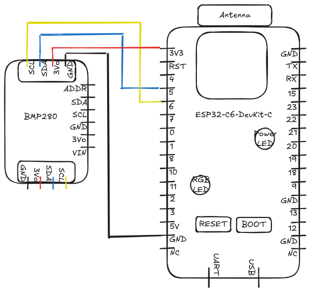

# BMP280_ESP32-C6

Basic reading of BMP280 Barometric sensor on a ESP32-C6 dev board.

## Components

- BMP280 :
    - Pressure sensor from 300 to 1 100 hPa  
    - Temperature measurement for more accurate results from -40 to + 85 °C
    - [Sensor technical sheet on manufacturer website](https://www.bosch-sensortec.com/products/environmental-sensors/pressure-sensors/bmp280/)
- ESP32-C6-DevKit C1
    - System on a Chip (SoC)
    - [SoC technical sheet on manufacturer website](https://www.espressif.com/en/products/socs/esp32-c6)


## Electronic diagram

Interface used : I²C




## IDE & Librairies

Developed on Arduino IDE 2.3.6

Librairies required : 
 - for I2C interface : Wire.h
 - for BMP280 : Adafruit_BMP280.h


## Example of output

```
Temperature: 22.35 °C
Pressure: 1008.90 hPa
Approx. Altitude: 36.28 m

Temperature: 22.35 °C
Pressure: 1008.90 hPa
Approx. Altitude: 36.26 m
```
